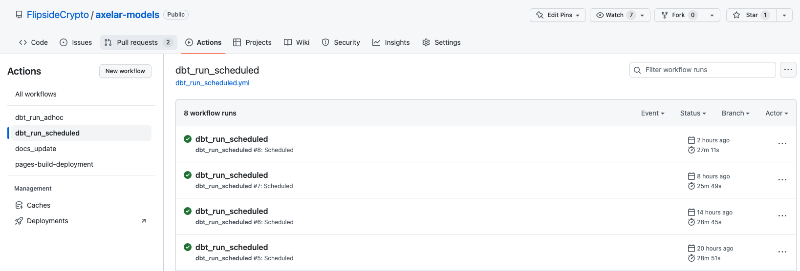
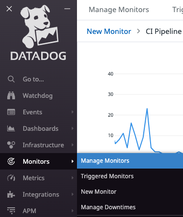

# run-dbt-command in github action 

## First time configuration 

### Step 1: Checkout the main branch 
- `git checkout main`
    - switch to main branch firstly as we would like the update applied to main branch
- `git pull`
    - pull the latest update in main branch to make it up-to-date

### Step 2: Create a new branch based on main for the upcoming merge
Reason we need to do this step is that the remote pushed branch doesn't have all the main branch information, we cannot easily just push that as it only contains the github workflow needed files
- `git checkout -b add-dbt-run-github-action-to-repo`

### Step 3: Checked out the changes
- `git checkout AN-2377-added-schedule-dbt-run-template-github-actions .github/workflows`:
    - The updated files are sit under the branch `AN-2377-added-schedule-dbt-run-template-github-actions`, we only want to check out that folder containing this information 

### Step 4: Submit PR and merge it to main
- `git add .`
- `git commit -m 'add the dbt run workflow to main branch`
- `git push`
- Submit the PR in Github for approval 

### Step 5: Set up the repository secrets
Go to `Github Repo -> Settings -> Environments`, click create new environment, call it `workflow`, and then type in the following information one by one:

```yml
ACCOUNT: 
DATABASE_DEV: 
DATABASE_PROD: 
PASSWORD: 
REGION: 
ROLE: 
SCHEMA: 
USER: 
WAREHOUSE_DEV: 
WAREHOUSE_PROD: 
```

Here take axelar as an example for the information we need to type, basically it looks like the one we used in dbt cloud

```yml
ACCOUNT: vna27887.us-east-1
DATABASE_DEV: AXELAR_DEV
DATABASE_PROD: AXELAR
PASSWORD: userpassword
REGION: us-east-1
ROLE: DBT_CLOUD_AXELAR
SCHEMA: silver
USER: DBT_CLOUD_AXELAR
WAREHOUSE_DEV: DBT_CLOUD
WAREHOUSE_PROD: DBT_CLOUD
```

*screenshot for the location of the environment in the settings:*

*TODO: Here we will only keep the account credential here and move the basic settings to the template, like the account, warehouse etc.*


## Running Commands
### Run it as a scheduled job
Go to `dbt_run_scheduled.yml` file and there are 2 things need to be updated
- **scheduled cron**: updated it to what you want, 20 mins, 10 mins or 6 hours
    -  
- **dbt commands**: updated it to the commands you want to run
    -  
    - Here are some commands samples:
        - Run it in prod:  `'["dbt run -m ./models/streamline/streamline__txs_history.sql --target prod"]'`
        - Run multiple commands (It is going to be in parallel to speed up): `'["dbt run -m ./models/streamline/streamline__txs_history.sql --target prod", "dbt run -m ./models/streamline/streamline__blocks_history.sql --target prod"]'`
        - Including/excluding models and custom dbt run parameters: THe running command is exactly the same as in the dbt run, just find the corresponding DBT commands and wrapped them inside the `'[""]'` is fine, for example, the excluding command can be something like: `'["dbt run -m ./models/streamline/*.sql --exclude"]'`
- **Run History**: The run history and log can be found in the action history page:
    -  
### Run it as an ad-hoc job
Go to the Action and click the dbt_run_adhoc and type in the command you want to run, please note here that the command you type cannot includ the `'` at beginning and end, it should look something like: `["dbt run -m ./models/streamline/streamline__txs_history.sql --target prod"]`
 


## Set up Datadog for testing alert
We are using the Datadog to set up the connection for failed tests. Here is the reference documentation to the connection between datadog, github action and connection to slack channel: https://docs.datadoghq.com/integrations/slack/?tab=slackapplication. 

### Create a Slack Channel for alert
Go to Slack and create a channel, named it as `alerts-xxx(your project)-github-actions` and invite the people you want to invite

### Invite Datadog to the channel
Type `/invite @Datadog` in the chat channel to invite datadog to the channel 

### Datadog set up 
Go to Datadog and click the Monitor to set up the connection:
- Step 1: Click the Monitors to add new Monitor, click New Monitor button at the top right
    -  
- Step 2: Set up the configuration for under which conditions you want to send the alerts. by changing the filter type you can filter only to your project repo
    -  
- Step 3: Don't forget to mention your slack channel and the correct people to handle that
    -  
